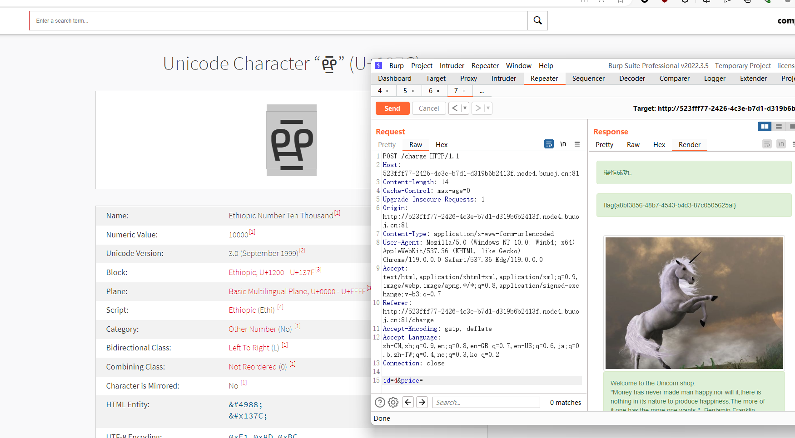

没看懂这题目想干嘛，看起来是需要购买第四个商品才可以得到 flag

然而购买第四个时会回显 not enough money，而 id 为其他的时候又会回显 wrong commodity

没看懂，这边尝试搜了一下 unicode 编码的安全问题

https://blog.lyle.ac.cn/2018/10/29/unicode-normalization/

所以这里的思路应当是以一个字符，去替换 1337

接着我们在这个网站搜索 **thousand ，就可以购买第四个商品了:**https://www.compart.com/en/unicode/

