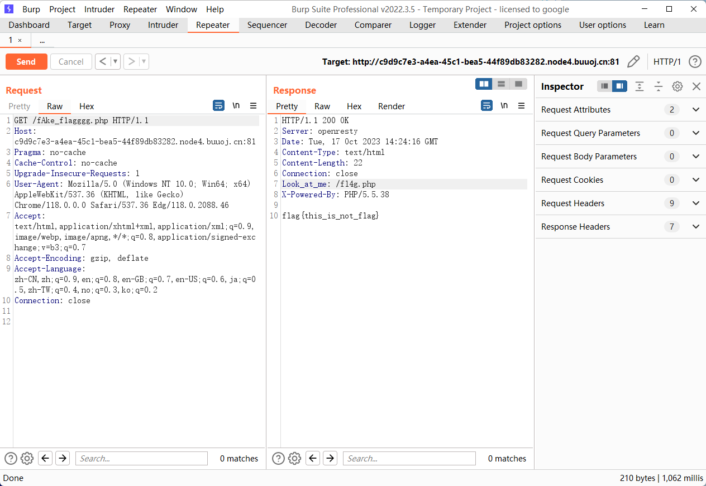

dirsearch 发现 robots.txt，访问结果

```http
User-agent: *
Disallow: /fAke_f1agggg.php
```



访问 `/fl4g.php`

这里已知服务端是 php5，就很容易了

第一个条件

```php
if (isset($_GET['num'])){
    $num = $_GET['num'];
    if(intval($num) < 2020 && intval($num + 1) > 2021){
```

GET接收num传参，num要小于2020，加1之后要大于2021，否则要么die，要么还是die
随后查询`intval()`函数的使用方式，**如果intval函数参数填入科学计数法的字符串，会以e前面的数字作为返回值**；但是如果先**科学计数法+数字**，此时会先将科学计数法变为正常的数再进行加法运算，之后才传入`intval()`进行转换。

**注意：该方法只有php5才生效**

第二个是经典的 md5 bypass

`?md5=0e215962017`

第三个这里用`$IFS$1或者${IFS}` 绕过空格校验即可。


